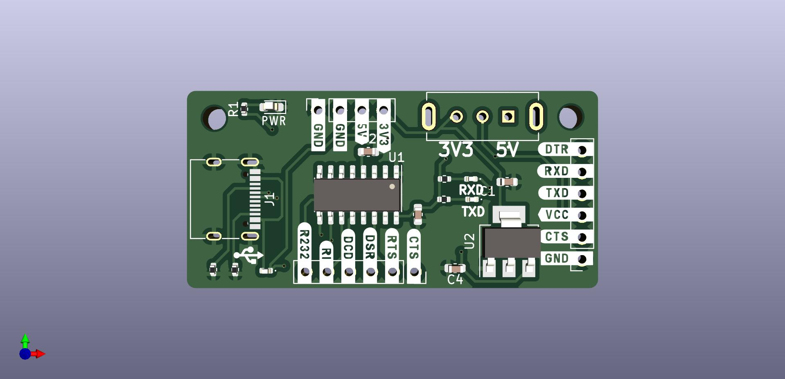

# USB-C FTDI Breakout Board Design

This repository contains the design files for a USB-C FTDI breakout board created using KiCad. This breakout board is designed to convert USB signals to serial communication, making it useful for programming, debugging, and interfacing with microcontrollers and other serial devices.

## Project Overview

This project includes:
- **Schematic Design**: Circuitry for FTDI (USB-to-Serial) chip with USB-C connector.
- **PCB Layout**: Compact PCB design for easy connection to serial devices.
- **Production Files**: Gerber files and a BOM (Bill of Materials) for manufacturing.

## Features

- **USB-C Connector**: Modern USB-C connection for compatibility with most modern devices.
- **FTDI Chip**: USB-to-Serial conversion for programming and debugging.
- **Breakout Pins**: Exposed TX, RX, VCC, and GND pins for easy connection.
- **Voltage Selection**: Supports 3.3V and 5V operation via a jumper or switch.
